<h1 align="center">👋 Hi there, I'm Ryan</h1>

    

  
<code>Programming: Languages</code>

   

      

  
<code>Programming: Libraries</code>

   

           

     

  
<code>Tools: GUI</code>

   

   

  

  

  
<code>Tools: Design</code>

   

   

   

   

  
<code>Tools: CLI</code>

    

  
<code>Platforms</code>

   

    

   

  
<code>Databases</code>

   

   

  

  
<code>Operating Systems</code>

   

     

  

  

  
<code>Markup & Schemas</code>

   

    

   

<h2 align="center">Papers & Research</h2>

| **Publication** | Preview |
|---|---|
| *CarSentoGram: GeoVisual Text Analytics for Exploring Variation in Public Discourse on Twitter* ([demo](https://ryan-p-larson.github.io/paper/), [source](https://github.uiowa.edu/ckoylu/immigration), [publication](https://www.tandfonline.com/doi/full/10.1080/15230406.2018.1510343)). | 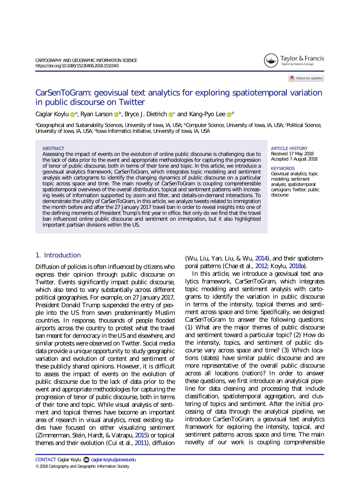 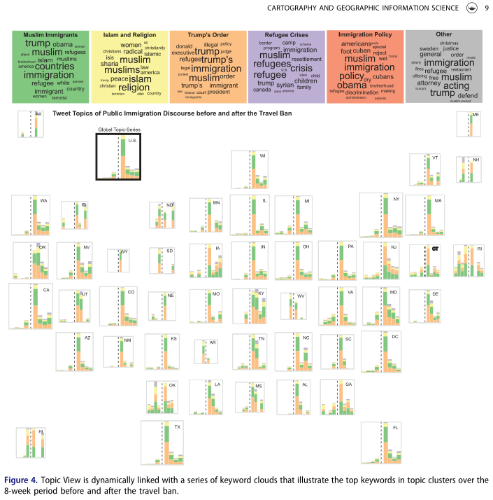  |
| Cartogrid, from [*Understanding the Effect of the Travel Ban on Immigration Tweets in the United States*](https://github.com/ryan-p-larson/gviz) in Political Networks 2017 proceedings. | 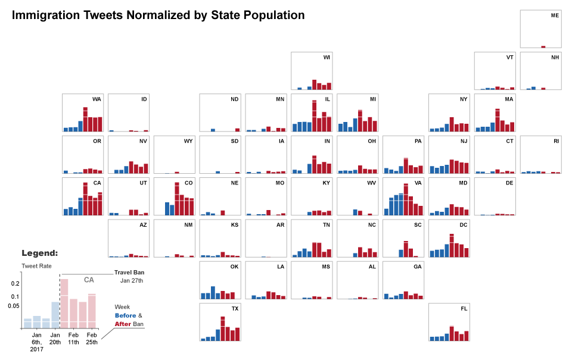</img> |
| Fake news and propoganda from  [*The Opinion Machine: An Aggregated Analysis of Political Spam on Twitter*](https://github.com/ryan-p-larson/polititweets). | 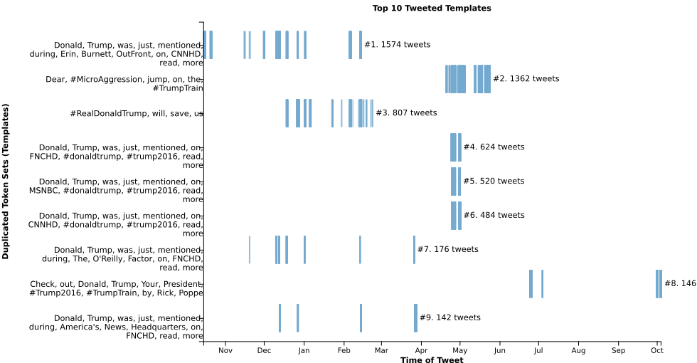</img> 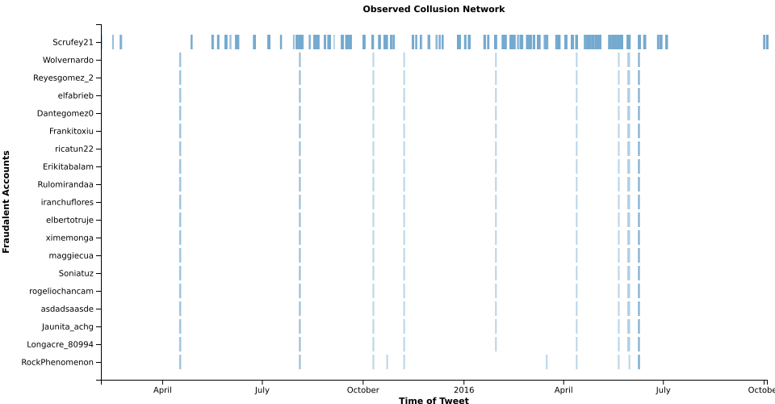</img> |

<h2 align="center">Past Work</h2>

| **Project** | Preview |
|---|---|
| CPHB-Events: An web application for managing events at The College of Public Health. Features include classroom calendars, drag'n'drop floorplan diagrams, and interactive forms. [View live!](https://cphb-events.public-health.uiowa.edu) | 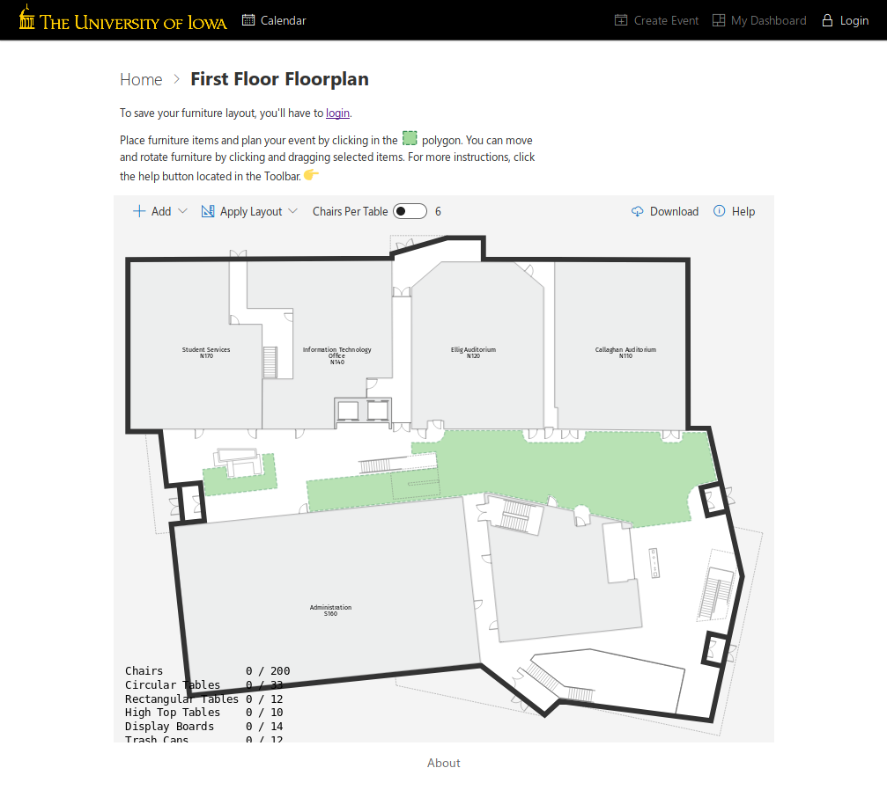 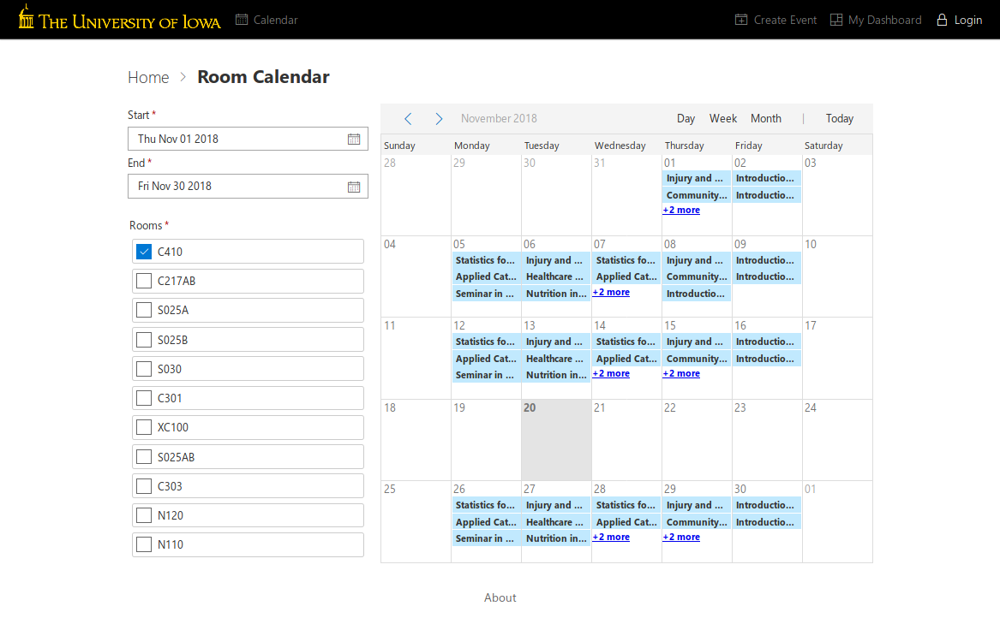  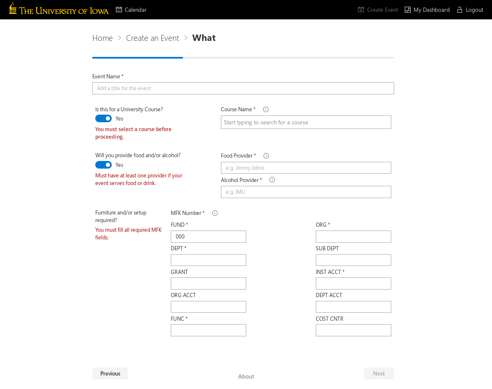|
| [ACT Internship - Continuum Reporting Project](https://github.com/ryan-p-larson/continuum-reporting) | 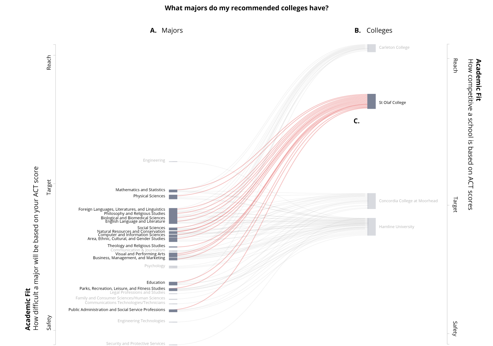</img> |
| [College Curriculum Diagram](https://github.com/ryan-p-larson/college-sankey) | 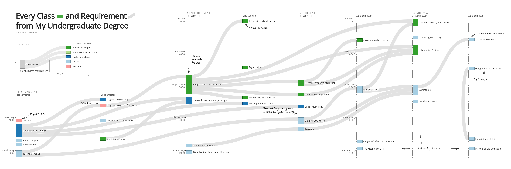</img> |
| Higher Knowledge Graph ([source](https://github.com/ryan-p-larson/higher-knowledge-graph), [demo](https://ryan-p-larson.github.io/higher-knowledge-graph)) | 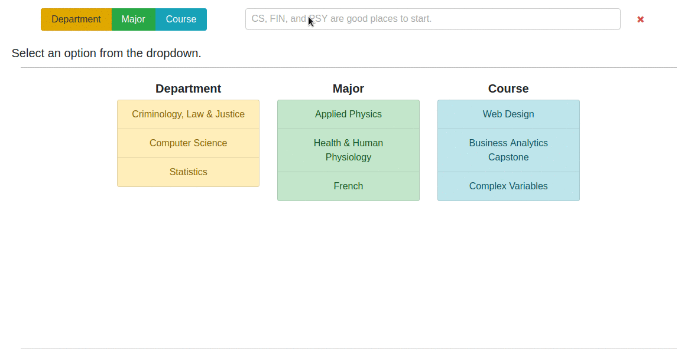 |
| [International Writer's Program Mapping Project](https://www.github.com/ryan-p-larson/iwp) | </img> |
| [Geographic Visualization Portfolio](https://geog3540.github.io/ryan-p-larson/) | 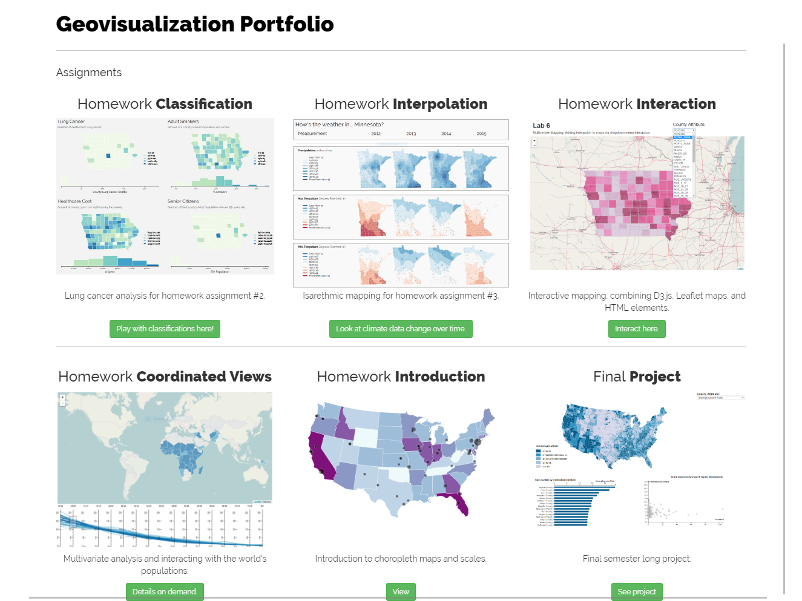</img> |
| [Hispanic Vote in Iowa](https://github.com/ryan-p-larson/DI-Hisp), see it in the [Daily Iowan](http://daily-iowan.com/2016/11/02/el-voto/). | 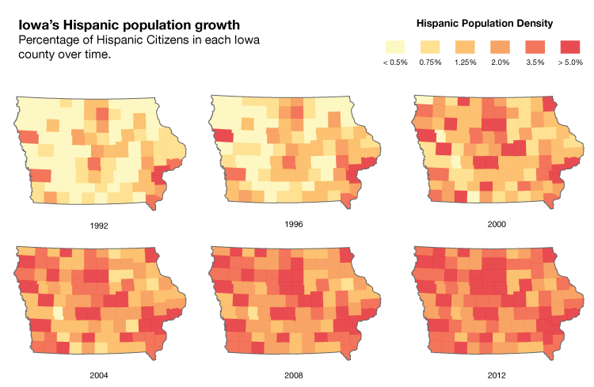</img> 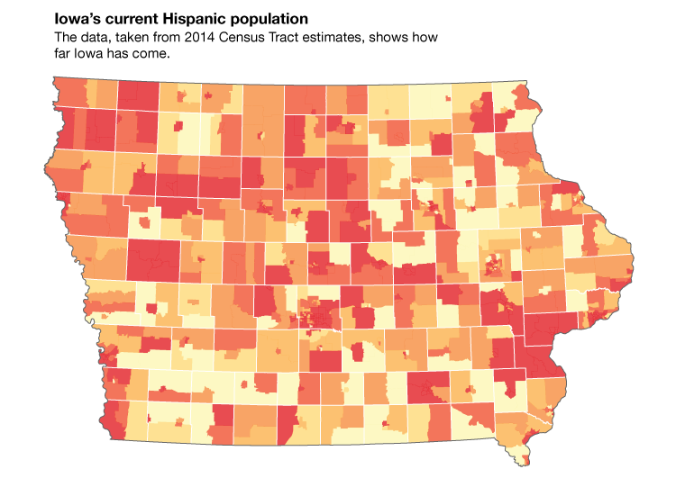</img> 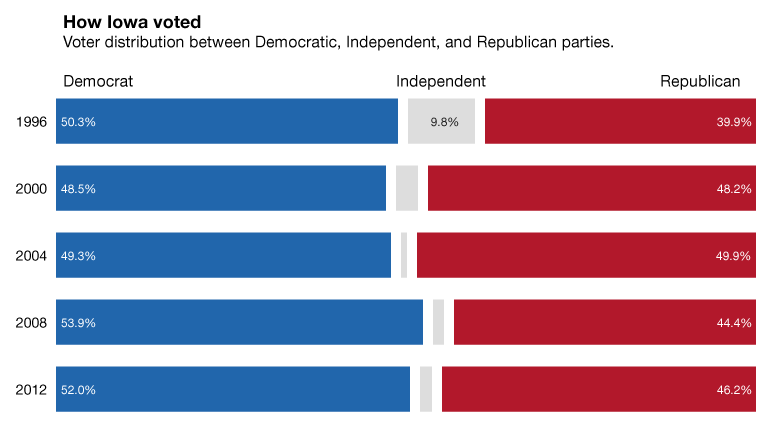</img> |
| [Iowa City Arrests](https://github.com/ryan-p-larson/arrests) | 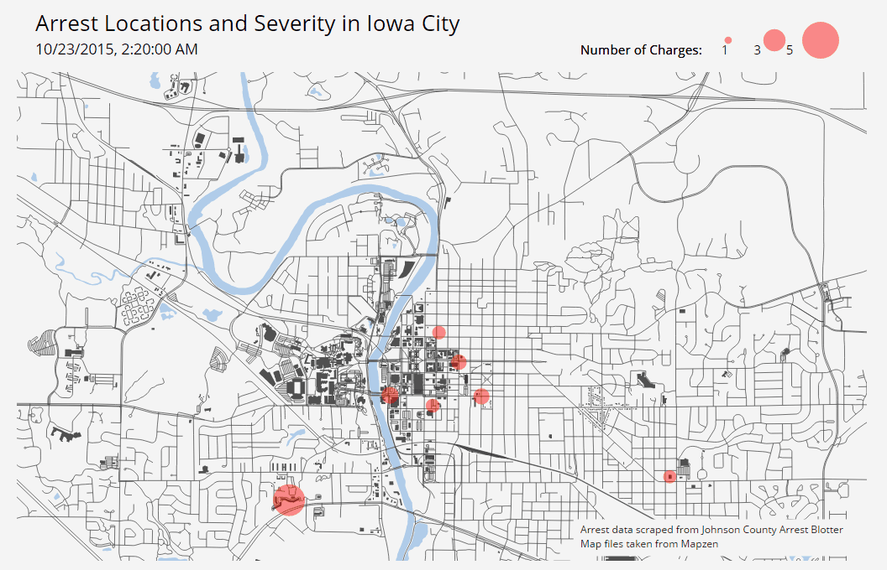</img> |
| *Real-time headpose tracking using OpenCV and webcams* (closed source :[ ) | </img> |